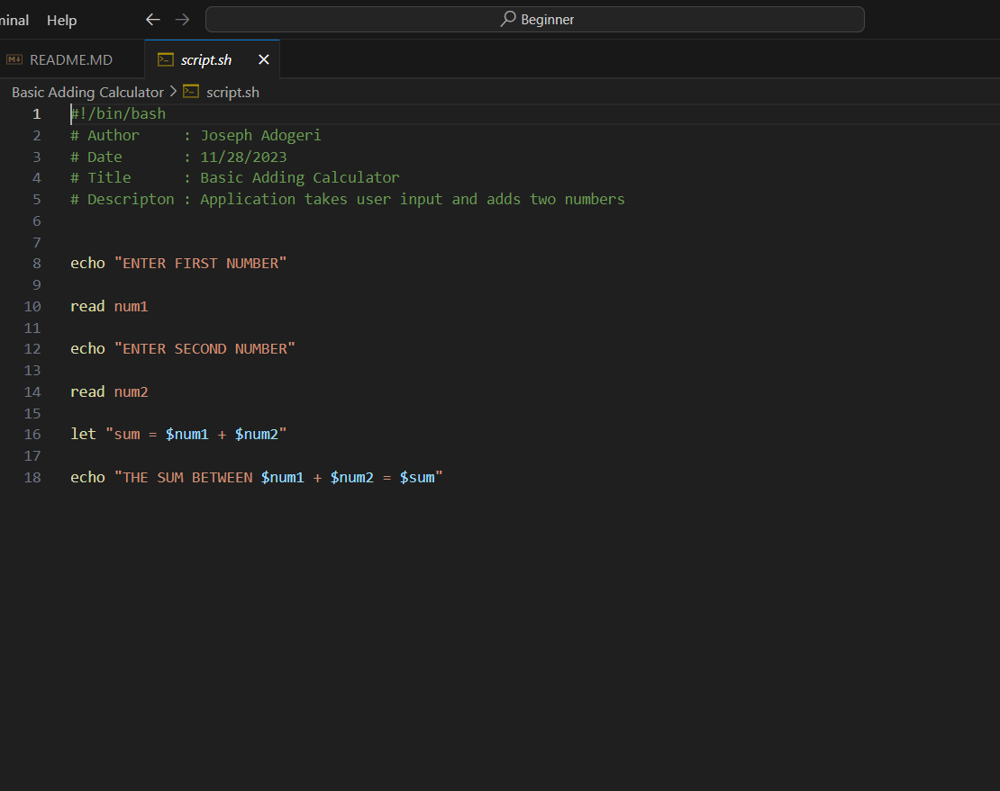
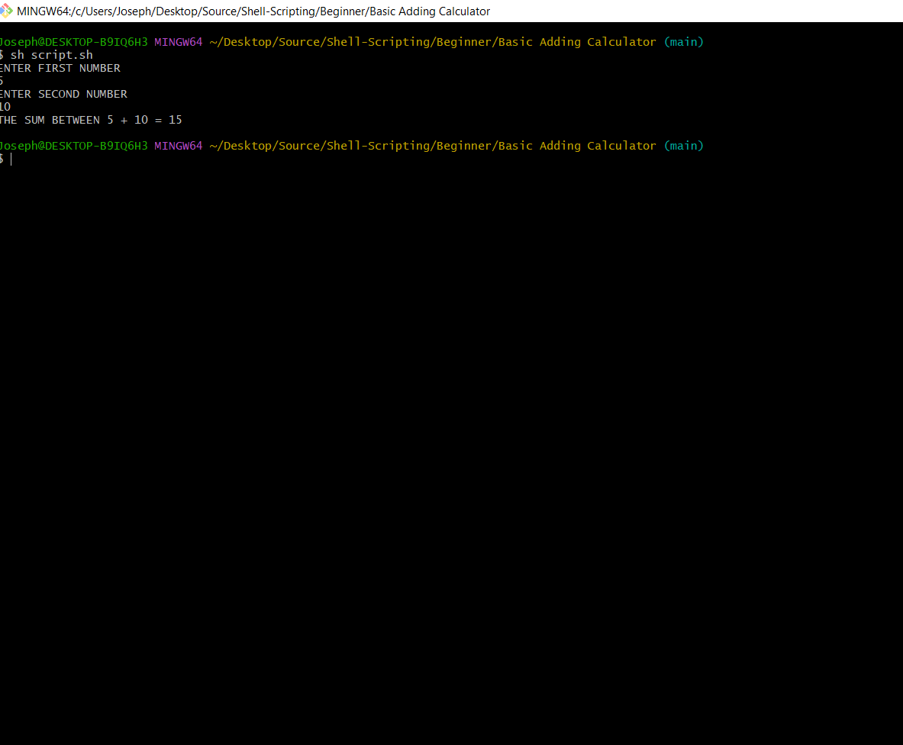

# Basic Adding Calculator

## Description
Shell script to add two numbers.

## Authors

- [@jadogeri](https://www.github.com/jadogeri)

## Table of Contents

- [Screenshots](#screenshots) 
- [Usage](#usage)
- [Run Locally](#run-locally)
- [About me](#about-me)
- [License](#license)
- [Credits](#credits)

## Screenshots

    |                    
 

## Usage

### Run Locally

#### Get Project 

1. Download from Github
2. Clone the project 

1. Download from Github
. Navigate to project using link [Shell Scripting](https://github.com/jadogeri/Shell-Scripting)
. Click on the code button.
. Choose the option Download Zip .
. Navigate to location where the zipped file was saved.
. Place cursor on file, right click using mouse then choose extract file.

Go to the project directory

```bash
   cd Shell-Scripting/Beginner/Basic Adding Calculator
```

2. Clone the project 

```bash
  git clone https://github.com/jadogeri/Shell-Scripting.git
```

Go to the project directory

```bash
  cd Shell-Scripting/Beginner/Basic Adding Calculator
```

Start project

1. Open Terminal using command cmd or use editor.
2. Navigate to location project was saved i.e Shell-Scripting/Beginner/Basic Adding Calculator.

```bash
  cd Shell-Scripting/Beginner/Basic Adding Calculator
```
3 . type commsnd bash script.sh or bash script.sh

```bash
  sh script.sh
```

OR

```bash
  bash script.sh
```


## About Me  
🚀
I'm a Database Programmer learning shell scripting to automate tasks at my current job.


## License

[LICENSE](/Basic%20Adding%20Calculator/LICENSE)

## Credits

 - [Shell Scripting Crash Course - Beginner Level - FREE](https://youtu.be/v-F3YLd6oMw)
 - [Bash Shell Scripting Tutorial | Shell Scripting Tutorial | Learn Shell Programming - FREE](https://youtu.be/zWVV31NYi1U)
 - [Shell Scripting Tutorial | Shell Scripting Crash Course | Linux Certification Training | Edureka - FREE](https://youtu.be/GtovwKDemnI)
 - [Bash Scripting Full Course - FREE](https://youtu.be/e7BufAVwDiM)
